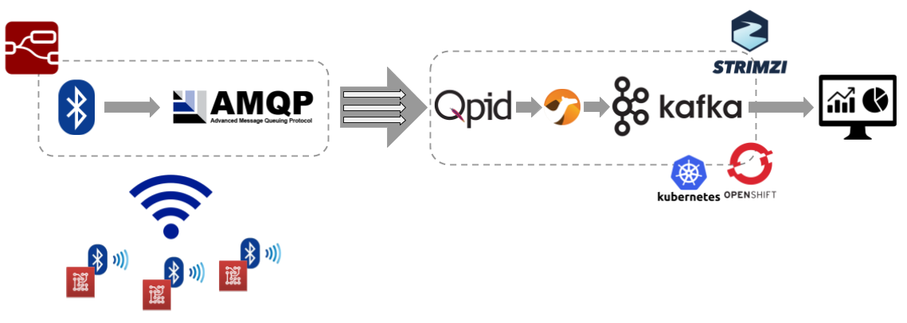

# Kafka Streams IoT

# OpenShift cluster

In order to run this demo, you need an OpenShift cluster up and running.
The simpler way for having that on your laptop is using the `minishift` tool you can download and install it following the instructions [here](https://docs.okd.io/latest/minishift/getting-started/installing.html).
After that, start the OpenShift cluster running the command:

    minishfit start

> The cluster will take few minutes to be ready.

# Strimzi and Kafka cluster deployment

In order to deploy the Kafka cluster (on OpenShift) for ingesting the data, the [Strimzi](https://strimzi.io/) project is used.
Download the latest release from [here](https://strimzi.io/downloads/) and extract the archive.

    wget https://github.com/strimzi/strimzi-kafka-operator/releases/download/0.10.0/strimzi-0.10.0.tar.gz
    tar xvzf strimzi-0.10.0.tar.gz
    rm strimzi-0.10.0.tar.gz
    cd strimzi-0.10.0

In order to install the Strimzi Cluster Operator, the logged OpenShift user needs admin rights and the simple way is to login as `system:admin`.

    oc login -u system:admin

If you are using the default OpenShift `myproject` as namespace for deploying the demo than you don't need any changes otherwise you have to modify the installation files according to the namespace the Cluster Operator is going to be installed in by running:

    sed -i 's/namespace: .*/namespace: my-project/' install/cluster-operator/*RoleBinding*.yaml

After that you can install the Cluster Operator by running:

    oc apply -f install/cluster-operator

A bunch of CRDs (Custom Resource Definitions) for handling Kafka related resources (Kafka cluster, topics, users and so on) will be installed.

For the demo purposes, it is enough to use the Kafka `ephemeral` cluster provided in the examples folder.
Run the following command for deploying it:

    oc apply -f examples/kafka/kafka-ephemeral.yaml

Accessing to the OpenShift web console you can see the Strimzi Cluster Operator and the Kafka cluster up and running.

# Qpid Dispatch Router deployment

In order to ingest the data from the IoT gateway, the AMQP 1.0 protocol is used.
For this reason, the [Qpid Dispatch Router](https://qpid.apache.org/components/dispatch-router/index.html) is used as entry point to the ingestion sysyem.
For accessing the QDR from outside the OpenShift cluster, a route is used so the TLS support is needed.
The demo provides some certificates (CA and router certificates with related keys) that you can use disabling the hostname verification for simplicity, otherwise you have to generate your own certificates.

First of all, create the Secret containing all the certificates.

    oc create secret generic qdrouterd-certs \
    --from-file=ca.crt=qdrouterd/certs/ca-cert.pem \
    --from-file=tls.crt=qdrouterd/certs/server-cert.pem \
    --from-file=tls.key=qdrouterd/certs/server-key.pem

After that, the QDR related OpenShift resources can be deployed running:

    oc apply -f qdrouterd/deployment/qdrouterd-config.yml
    oc apply -f qdrouterd/deployment/qdrouterd.yml
    oc apply -f qdrouterd/deployment/qdrouterd-service.yml
    oc apply -f qdrouterd/deployment/qdrouterd-route.yml

Accessing to the OpenShift web console you can see the QDR deployment.

From its log, you can notice that it is listening on AMQPS (5671) port for getting TLS encryted connections from outside and on port AMQP (5672) that will be used inside the OpenShift cluster for connecting the Apache Camel application for bridging data from AMQP to Apache Kafka.

