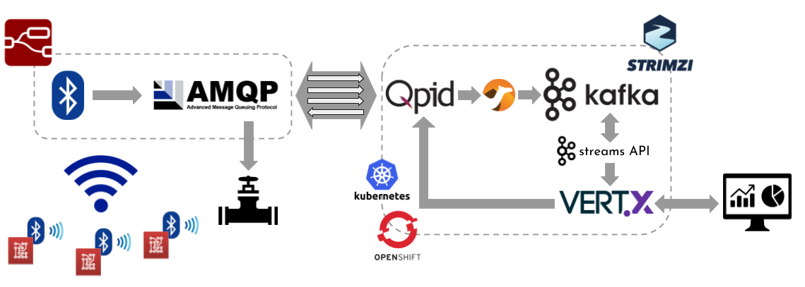
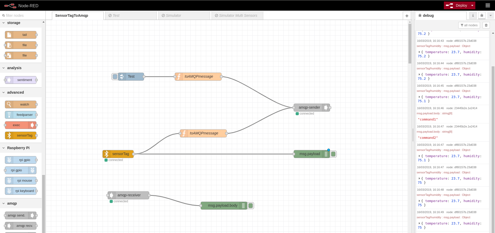

# Kafka Streams IoT

# OpenShift cluster

In order to run this demo, you need an OpenShift cluster up and running.
The simpler way for having that on your laptop is using the `minishift` tool you can download and install following the instructions [here](https://docs.okd.io/latest/minishift/getting-started/installing.html).
After that, start the OpenShift cluster running the command:

    minishfit start

> The cluster will take few minutes to be ready.

# Strimzi and Kafka cluster deployment

In order to deploy the Kafka cluster (on OpenShift) for ingesting the data, the [Strimzi](https://strimzi.io/) project is used.
Download the latest release from [here](https://strimzi.io/downloads/) and extract the archive.

    wget https://github.com/strimzi/strimzi-kafka-operator/releases/download/0.11.1/strimzi-0.11.1.tar.gz
    tar xvzf strimzi-0.11.1.tar.gz
    rm strimzi-0.11.1.tar.gz
    cd strimzi-0.11.1

In order to install the Strimzi Cluster Operator, the logged OpenShift user needs admin rights and the simple way is to login as `system:admin`.

    oc login -u system:admin

If you are using the default OpenShift `myproject` as namespace for deploying the demo than you don't need any changes otherwise you have to modify the YAML installation files according to the namespace the Cluster Operator is going to be installed in by running:

    sed -i 's/namespace: .*/namespace: my-project/' install/cluster-operator/*RoleBinding*.yaml

After that you can install the Cluster Operator by running:

    oc apply -f install/cluster-operator

A bunch of CRDs (Custom Resource Definitions) for handling Kafka related resources (Kafka cluster, topics, users and so on) will be installed.

As Kafka cluster resource, for the demo purposes, it is enough to use the Kafka `ephemeral` cluster YAML definition provided in the examples folder.
Run the following command for deploying it:

    oc apply -f examples/kafka/kafka-ephemeral.yaml

Accessing to the OpenShift web console you can see the Strimzi Cluster Operator and the Kafka cluster up and running.

# Qpid Dispatch Router deployment

In order to ingest the data from the IoT gateway, the [AMQP 1.0](https://www.amqp.org/) protocol is used.
For this reason, the [Qpid Dispatch Router](https://qpid.apache.org/components/dispatch-router/index.html) is used as the entry point to the ingestion sysyem.
For accessing the QDR from outside the OpenShift cluster, a route is used so the TLS support is needed.
The demo provides some certificates (CA and router certificates with related keys) that you can use disabling the hostname verification for simplicity, otherwise you have to generate your own certificates.

First of all, create the Secret containing all the certificates.

    oc create secret generic qdrouterd-certs \
    --from-file=ca.crt=qdrouterd/certs/ca-cert.pem \
    --from-file=tls.crt=qdrouterd/certs/server-cert.pem \
    --from-file=tls.key=qdrouterd/certs/server-key.pem
    oc label secret qdrouterd-certs app=iot-demo

After that, the QDR related OpenShift resources can be deployed running:

    oc apply -f qdrouterd/deployment/qdrouterd-config.yml
    oc apply -f qdrouterd/deployment/qdrouterd.yml
    oc apply -f qdrouterd/deployment/qdrouterd-service.yml
    oc apply -f qdrouterd/deployment/qdrouterd-route.yml

Accessing to the OpenShift web console you can see the QDR deployment.

From its log, you can notice that it is listening on AMQPS (5671) port for getting TLS encryted connections from outside and on port AMQP (5672) that will be used inside the OpenShift cluster for connecting the Apache Camel application for bridging data from AMQP to Apache Kafka.

# Deploy topics, Kafka Streams and consumer applications

This demo uses a couple of topics.
The first one named `iot-temperature` is used by the device for sending temperature values and by the stream application for getting such values and processing them.
The second one is the `iot-temperature-max` topic where the stream application puts the max temperature value processed in the specified time window.
In order to create these topics in the Kafka cluster, the Topic Operator can be used.
Running the following command, a file containing two `KafkaTopic` custom resources is deployed to the OpenShift cluster and used by the Topic Controller for creating such topics.

    oc apply -f https://raw.githubusercontent.com/strimzi/strimzi-lab/master/iot-demo/stream-app/resources/topics.yml

The stream application uses Kafka Streams API reading from the `iot-temperature` topic, processing its values and then putting the max temperature value in the specified time window into the `iot-temperature-max` topic.
It's deployed running following command :

    oc apply -f https://raw.githubusercontent.com/strimzi/strimzi-lab/master/iot-demo/stream-app/resources/stream-app.yml

The consumer application uses Kafka client in order to get messages from the `iot-temperature-max` topic and showing them in a Web UI.
It's deployed running following command :

    oc apply -f https://raw.githubusercontent.com/strimzi/strimzi-lab/master/iot-demo/consumer-app/resources/consumer-app.yml

A route is provided in order to access the related Web UI.

# Deploy the Apache Camel AMQP to Kafka

In order to bridge the data from the Qpid Dispatch Router over AMQP to Apache Kafka, an Apache Camel application with a related route is provided.
It's deployed running following command:

    oc apply -f camel-amqp-kafka/deployment/camel-amqp-kafka.yml

You can find the related source code under the `camel-amqp-kafka` folder.

# Deploy the Node-Red application

The IoT gateway (which could be your laptop for this demo) is built using [Node-Red](https://nodered.org) that you have to download and install following the instructions on the official website.

After installing it, the flow `sensortag-to-amqp.json` under the folder `node-red` has to be imported.

It uses a couple of custom nodes:

* SensorTag: a node which is able to connect to a [SensorTag](http://www.ti.com/tools-software/sensortag.html) for getting the sensors data.
* AMQP 1.0 rhea node: an AMQP 1.0 node based on the [rhea](https://github.com/amqp/rhea) JavaScript library.

The SensorTag node can be installed following the documentation [here](node-red/sensortag.md) because it's an hacked version of the original one for running on newer versions of NodeJS.

The SensorTag node can be configured to send just humidity and temperature values (this demo handles just temperature ones).

The AMQP 1.0 rhea node can be installed from the official NPM website [here](https://www.npmjs.com/package/node-red-contrib-rhea)

The AMQP 1.0 node configuration needs:

* an AMQP endpoint where the Host has to be the OpenShift route address of the Qpid Dispatch Router.
* SSL/TLS enabled with a TLS configuration node importing the CA certificate used for signing the Qpid Dispatch Router server certificate.
* the AMQP address set to `iot-temperature` for sending temperature values.

You can get the OpenShift route of the Qpid Dispatch Router with following command:

    oc get routes qdrouterd -o=jsonpath='{.status.ingress[0].host}{"\n"}'

Finally, deploy the flow on the Node-Red instance.

## Outcome

The Node-Red flow, acting as an IoT gateway, gets the temperature values from the SensorTag via BLE translating to AMQP 1.0 and proxying the traffic to OpenShift.
The Qpid Dispatch Router and the Apache Camale route forward the traffic to Apache Kafka with the Streams API application handling the data.
The consumer Web UI application will show a dashboard with the temparature value in the last window highlighting a value over the threshold.

## Simulator

If you want to try the ingestion pipeline without a SensorTag there is the data simulator flow `rng-to-amqp.json` under the `node-red` folder.
This flow can be imported in NodeRed and it provides a random generator node which every second generates temperature values between 15 and 25 degrees sending them over AMQP 1.0.

There is also the `rng-multisensors-to-amqp.json` flow which simulates different sensors multiplexed with links over a single AMQP connection from the IoT gateway to the Qpid Dispatch Router for reaching the Apache Kafka ingestion system.

You could replicate the same with different SensorTag(s) connected to the Node-Red based IoT gateway